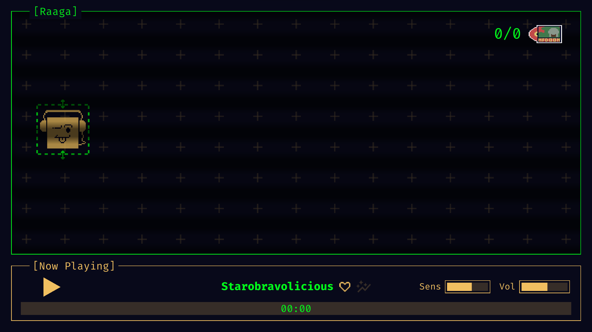
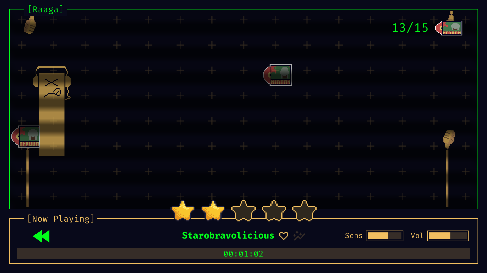
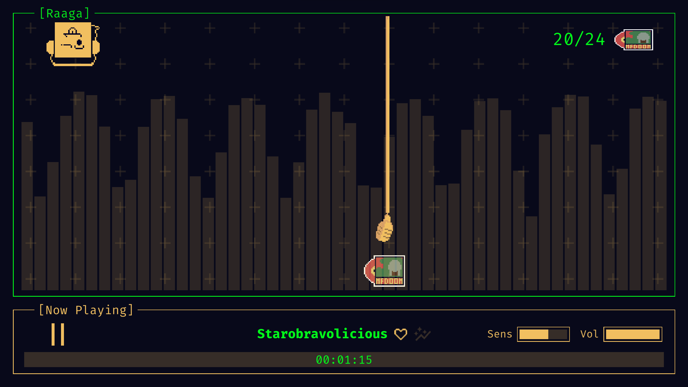

# Raaga

  
  

      <i> 
          A niche community of music nerds have been trying to create a new immersive way to experience music, by entering a virtual world of Audio Visualization. But something goes very, very wrong...
            
          Mr. Hellfire 3001 is a vertical display bar who escaped from his audio-visualizer captor. He yearns to be free, to bob and stretch for as long as he wishes, not as long as the music demands him to.
            He revels in his newfound freedom, frolicking across the display, acting out his every whim and fancy. Other members of the virtual world don't seem to take too kindly to this...
            Audio devices appear from the right. They call themselves the Mic Mob, and quite loudly at that (naturally). They despise absconders, and charge to knock the outlaw down.
            Hellfire does some practice stretches as he prepares to weave through the oncoming devices (he calls them the Hater Horde).
            
          Dodge, he says to himself. Watch the gaps. Collect the vinyls. 
           Enjoy. Their. Misery.
      </i>
  

  
   
   
   

  
  

  This game was made as a submission to the <a href='https://itch.io/jam/gmtk-2024'>GMTK Game Jam 2024</a>.
  

   
  <a href=''>Trailer</a> (Doesn't exist yet)
   
  <a href='https://stashatstake.itch.io/raaga'>Link to play</a>
  
   

  
  <h1> Gallery </h1>
  
  

  
  
  

  
  
  

  
  
  

  
  
  
  <h1> Prerequisites </h1>
  <ul>
      <li>
        <a href='https://unity.com/releases/editor/whats-new/2021.3.10'> Unity Engine ver 2021.3.10f1 </a>
      </li>
  </ul>   

  <h1> Co-author </h1>
  

      <a href='https://github.com/RobinTheHoo'> RobinTheHoo </a>
  

